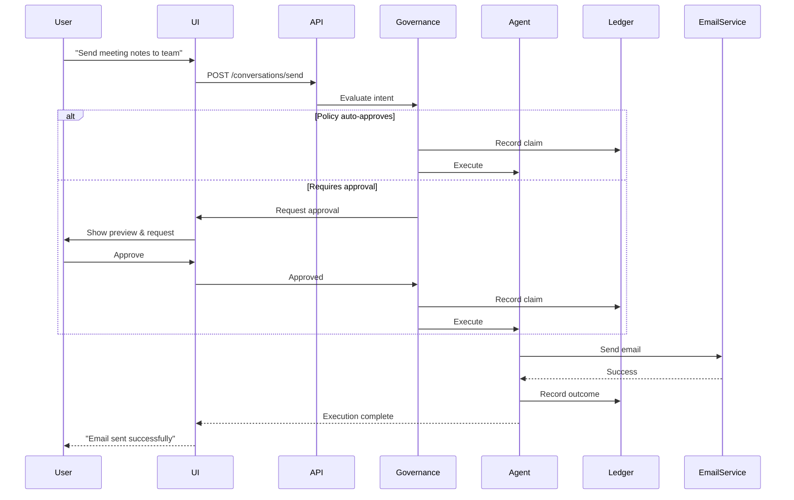

# Architecture

BlackRoad OS is built on a layered architecture designed for transparency, accountability, and control.

## System Layers

```
┌───────────────────────────────────────────────────────┐
│                   Presentation Layer                  │
│          (Web UI, Mobile, CLI, API Clients)           │
└────────────────────┬──────────────────────────────────┘
                     │
┌────────────────────▼──────────────────────────────────┐
│                   API Gateway                         │
│       (Authentication, Rate Limiting, Routing)        │
└────────────────────┬──────────────────────────────────┘
                     │
┌────────────────────▼──────────────────────────────────┐
│                Governance Engine                      │
│  (Policies, Intents, Delegations, Approval Flows)    │
└────────────────────┬──────────────────────────────────┘
                     │
┌────────────────────▼──────────────────────────────────┐
│                  Agent Runtime                        │
│       (Agent Execution, Tool Orchestration)           │
└────────────────────┬──────────────────────────────────┘
                     │
┌────────────────────▼──────────────────────────────────┐
│                   Ledger System                       │
│         (Immutable Audit Trail, Provenance)           │
└───────────────────────────────────────────────────────┘
                     │
┌────────────────────▼──────────────────────────────────┐
│                  Data & Storage                       │
│     (User Data, Agent State, Knowledge Base)          │
└───────────────────────────────────────────────────────┘
```

## Core Components

### 1. Governance Engine

The governance engine is the **heart of BlackRoad OS's accountability system**.

**Responsibilities:**
- Evaluate intents against policies
- Check delegations for permissions
- Generate governance claims
- Route approvals to users when needed
- Record decisions in the ledger

**Flow:**

```
User Request
    ↓
Parse Intent
    ↓
Check Policies ──→ Policy Match? ──→ Auto-Approve
    │                    │
    │                    ↓ No Match
    ↓
Check Delegations ──→ Delegation Exists? ──→ Approve
    │                    │
    │                    ↓ No Delegation
    ↓
Request User Approval ──→ User Decision ──→ Approve/Deny
    ↓
Record in Ledger
    ↓
Execute (if approved)
```

### 2. Agent Runtime

The agent runtime **executes approved actions**.

**Capabilities:**
- Load and manage agent code
- Provide sandboxed execution environment
- Orchestrate tool calls (APIs, databases, etc.)
- Stream execution updates to users
- Handle errors and retries

**Agent Lifecycle:**

```typescript
// 1. Agent initialization
agent.initialize({
  user: "user_123",
  context: { /* ... */ }
});

// 2. Intent processing
const intent = await agent.processInput("Send email to team");

// 3. Governance check
const claim = await governance.evaluate(intent);

// 4. Execution (if approved)
if (claim.approved) {
  await agent.execute(intent, claim);
}

// 5. Ledger entry
await ledger.record({
  agent: agent.id,
  intent,
  claim,
  outcome: "success"
});
```

### 3. Ledger System

The ledger provides **immutable audit trail**.

**Properties:**
- **Immutable**: Entries cannot be modified or deleted
- **Cryptographically signed**: Tamper-evident
- **Queryable**: Fast lookups by user, agent, time, etc.
- **Exportable**: Full data portability

**Schema:**

```typescript
interface LedgerEntry {
  id: string;                    // Unique entry ID
  timestamp: Date;               // When action occurred
  userId: string;                // Who initiated
  agentId: string;               // Which agent
  intent: Intent;                // What was requested
  claim: GovernanceClaim;        // Why it was approved
  outcome: "success" | "error";  // Result
  metadata: Record<string, any>; // Additional context
  signature: string;             // Cryptographic proof
}
```

## Data Flow

### Example: Sending an Email via Lucidia



## Deployment Architectures

### Single-User (Self-Hosted)

```
┌─────────────────┐
│   Your Device   │
│                 │
│  ┌───────────┐  │
│  │ BlackRoad │  │
│  │    OS     │  │
│  └───────────┘  │
│                 │
│  All data local │
└─────────────────┘
```

**Characteristics:**
- Full data sovereignty
- No external dependencies
- Run on: Docker, Kubernetes, bare metal

### Multi-User (Enterprise)

```
┌──────────────────────────────────────┐
│          Load Balancer               │
└────────┬────────────┬────────────────┘
         │            │
    ┌────▼────┐  ┌────▼────┐
    │ API Pod │  │ API Pod │
    └────┬────┘  └────┬────┘
         │            │
    ┌────▼────────────▼────┐
    │   Governance Engine   │
    └────┬──────────────────┘
         │
    ┌────▼────────────────┐
    │   Agent Runtime     │
    │   (Horizontal Scale)│
    └────┬────────────────┘
         │
    ┌────▼────────────────┐
    │   Ledger Database   │
    │   (Replicated)      │
    └─────────────────────┘
```

**Characteristics:**
- Multi-tenant isolation
- Horizontal scaling
- High availability
- Shared infrastructure, isolated data

## Security Model

### Principle of Least Privilege

Agents only get permissions they **explicitly need**:

```typescript
// ❌ Bad: Over-permissioned
delegation({
  agent: "lucidia",
  scope: "all" // Too broad!
});

// ✅ Good: Minimal permissions
delegation({
  agent: "lucidia",
  capability: "send_email",
  scope: {
    domains: ["company.com"],
    maxPerDay: 50,
    sizeLimit: "10MB"
  },
  expiresAt: "2026-01-01T00:00:00Z"
});
```

### Defense in Depth

Multiple layers of protection:

1. **Authentication** — Verify user identity
2. **Authorization** — Check permissions (delegations)
3. **Policy Enforcement** — Apply governance rules
4. **Sandboxing** — Isolate agent execution
5. **Auditing** — Record every action
6. **Encryption** — Protect data at rest and in transit

### Threat Model

BlackRoad OS protects against:

| Threat | Mitigation |
|--------|------------|
| **Unauthorized Agent Actions** | Governance engine + delegations |
| **Data Exfiltration** | Scoped permissions + audit trail |
| **Malicious Agents** | Code review + sandboxing |
| **Tampering** | Cryptographic signatures + immutable ledger |
| **Insider Threats** | Audit logs + principle of least privilege |

## Performance Considerations

### Caching Strategy

```
User Request
    ↓
Check Policy Cache ──→ Hit? ──→ Fast Path
    │                    │
    ↓ Miss               ↓
Evaluate Policy ────────┘
    ↓
Cache Result (TTL: 5 min)
```

### Scaling Points

- **Stateless API** — Horizontal scaling easy
- **Agent Runtime** — Can run multiple instances
- **Ledger** — Append-only, optimized for writes
- **Reads** — Use read replicas for queries

## Technology Stack

| Layer | Technology |
|-------|------------|
| **API** | Node.js + TypeScript |
| **Agent Runtime** | Isolated V8 contexts |
| **Governance** | Rule engine + PostgreSQL |
| **Ledger** | PostgreSQL (with event sourcing) |
| **Storage** | S3-compatible object storage |
| **Cache** | Redis |
| **Search** | PostgreSQL full-text search |

## Extensibility

### Custom Agents

BlackRoad OS supports custom agent development:

```typescript
import { Agent, Intent } from '@blackroad/sdk';

export class CustomAgent extends Agent {
  async processIntent(intent: Intent) {
    // Your logic here
    return {
      response: "...",
      requiresApproval: true
    };
  }
}
```

See: [Agent Development Guide](/agents/overview)

### Integration Points

- **Webhooks** — React to events
- **API** — Programmatic control
- **Plugins** — Extend functionality
- **Custom Tools** — Add new capabilities

## Next Steps

- [Governance Concepts](/concepts/governance)
- [Agent Development](/agents/overview)
- [API Reference](/api/overview)
- [Self-Hosting Guide](/self-hosting/overview)
