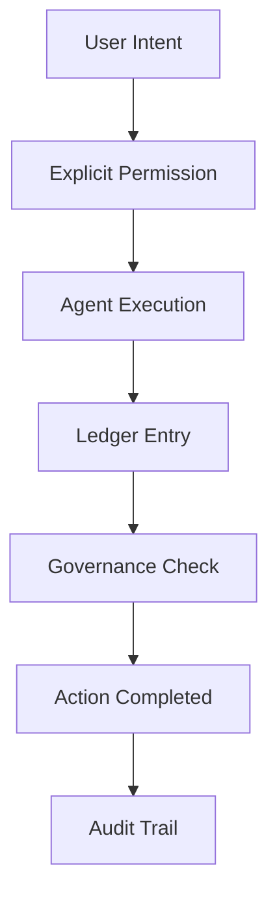

# Overview

BlackRoad OS is a transparent, accountable AI operating system designed to put **you** in control of your AI interactions.

## What Makes BlackRoad OS Different?

### Traditional AI Systems

Most AI systems today operate as black boxes:

- **Opaque Operations**: You don't know what the AI is doing or why
- **Hidden Objectives**: The AI optimizes for engagement, retention, or revenue
- **No Accountability**: When things go wrong, there's no audit trail
- **Limited Control**: You can't see or revoke permissions

### BlackRoad OS

BlackRoad OS takes a fundamentally different approach:



## Core Principles

### 1. Transparency

Every action in BlackRoad OS is **visible and explainable**:

- See what agents are doing in real-time
- Understand why decisions were made
- Review full execution history
- Export audit logs anytime

import { Callout } from 'nextra/components'

<Callout type="info">
  **Example**: When Lucidia sends an email on your behalf, you can see:
  - The exact email content before it's sent
  - Why Lucidia decided to send it
  - What data was used to compose it
  - The full approval chain
</Callout>

### 2. Consent

Nothing happens without **explicit permission**:

- **Delegations** — Grant specific permissions to agents
- **Policies** — Define rules for automatic approvals
- **Revocation** — Instantly withdraw any permission
- **Granular Control** — Permission down to individual actions

<Callout type="warning">
  Agents cannot "decide" to do things on their own. Every action requires either:
  1. Direct user approval (interactive)
  2. Pre-approved delegation (automatic)
  3. Policy-based governance (rule-driven)
</Callout>

### 3. Accountability

Every action creates an **immutable audit trail**:

- **Ledger Entries** — Permanent record of all actions
- **Governance Claims** — Why each action was approved
- **Provenance Tracking** — Full chain of custody for decisions
- **Compliance Ready** — Built-in audit capabilities

## System Architecture

At a high level, BlackRoad OS consists of:

```
┌─────────────────────────────────────────┐
│           User Interface                │
│    (Web, CLI, API, Mobile)              │
└──────────────┬──────────────────────────┘
               │
┌──────────────▼──────────────────────────┐
│         Governance Layer                │
│   (Policies, Intents, Delegations)      │
└──────────────┬──────────────────────────┘
               │
┌──────────────▼──────────────────────────┐
│          Agent Runtime                  │
│      (Lucidia, Custom Agents)           │
└──────────────┬──────────────────────────┘
               │
┌──────────────▼──────────────────────────┐
│           Ledger System                 │
│     (Immutable Audit Trail)             │
└─────────────────────────────────────────┘
```

See [Architecture](/concepts/architecture) for detailed diagrams.

## Key Concepts

### Agents

Agents are AI entities that perform tasks on your behalf. Examples:

- **Lucidia** — Your primary AI companion
- **Finance Agent** — Manages budgets and transactions
- **Research Agent** — Gathers and synthesizes information
- **Custom Agents** — Build your own

Learn more: [Agents Concept](/concepts/agents) | [Build Agents](/agents/overview)

### Intents

Intents are **structured representations of what you want to accomplish**:

```typescript
{
  intent: "send_email",
  target: "john@example.com",
  subject: "Meeting Follow-up",
  requiresApproval: true,
  context: {
    meeting: "product-sync-2025-12-22"
  }
}
```

Learn more: [Intents Concept](/concepts/intents)

### Delegations

Delegations are **explicit grants of permission** to agents:

```typescript
{
  agent: "lucidia",
  capability: "send_email",
  scope: {
    domain: "example.com",
    maxPerDay: 10
  },
  expiresAt: "2026-01-01T00:00:00Z"
}
```

Learn more: [Governance](/concepts/governance)

### Policies

Policies are **rules that govern automatic approvals**:

```typescript
{
  name: "auto-approve-internal-emails",
  condition: {
    intent: "send_email",
    target: { endsWith: "@company.com" },
    size: { lessThan: "10KB" }
  },
  action: "approve"
}
```

Learn more: [Policies](/concepts/policies)

### Ledger

The ledger is an **immutable record of all actions**:

```typescript
{
  id: "ledger_abc123",
  timestamp: "2025-12-22T23:30:00Z",
  agent: "lucidia",
  intent: "send_email",
  claim: "delegation_xyz789",
  outcome: "success",
  metadata: { /* ... */ }
}
```

Learn more: [Ledger](/concepts/ledger)

## Use Cases

### Personal AI Assistant

- Manage email, calendar, tasks
- Research and summarize information
- Automate repetitive workflows
- All with full transparency and control

### Enterprise Automation

- Deploy custom agents for business processes
- Enforce governance policies
- Maintain compliance audit trails
- Self-host for data sovereignty

### Developer Platform

- Build agents using BlackRoad OS SDK
- Integrate with existing systems via API
- Create vertical-specific "packs"
- Monetize your agents

## Getting Started

Ready to dive in?

1. **Quickstart**: [Your First Conversation](/quickstart/first-conversation)
2. **Build**: [Create Your First Agent](/quickstart/first-agent)
3. **Deploy**: [Self-Hosting Guide](/self-hosting/overview)

## Philosophy

BlackRoad OS was born from a simple question:

> If systems can break families, can systems also heal them?

Alexa Louise Amundson spent 15 years watching how technology systems extract value from people. She decided to build a system that **gives value back**.

The result is BlackRoad OS — and Lucidia, its voice.

Learn more: [Meet Lucidia](/concepts/lucidia) | [lucidia.earth](https://lucidia.earth)

## Next Steps

- [Architecture Deep Dive](/concepts/architecture)
- [Understanding Governance](/concepts/governance)
- [Agent Concepts](/concepts/agents)
- [API Overview](/api/overview)
