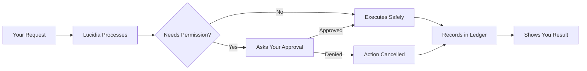

# Your First Conversation

Get started with BlackRoad OS in under 5 minutes.

## Prerequisites

- A BlackRoad OS account (sign up at [app.blackroad.io](https://app.blackroad.io))
- Or: A self-hosted instance ([setup guide](/self-hosting/docker))

## Step 1: Access the Platform

Visit [app.blackroad.io](https://app.blackroad.io) or your self-hosted instance.

## Step 2: Meet Lucidia

When you first log in, you'll be greeted by Lucidia, your AI companion.

```
Lucidia: Hello! I'm Lucidia. I'm here to help you with whatever
you need — but I'll always ask before taking action. What would
you like to work on today?
```

## Step 3: Start a Conversation

Try asking Lucidia something simple:

```
You: What's the weather like today?
```

Lucidia will respond based on available tools and permissions.

## Step 4: Observe Transparency

Notice how Lucidia shows you:

- **What she's thinking** — Her reasoning process
- **What tools she wants to use** — API calls, data access
- **Why she needs permission** — Clear explanations

Example interaction:

```
You: Send a summary of this conversation to alex@example.com

Lucidia: I can help with that. To send an email, I'll need your
permission. Here's what I'm planning to send:

┌─────────────────────────────────────┐
│ To: alex@example.com                │
│ Subject: Conversation Summary       │
│ Body: [Shows full email preview]    │
└─────────────────────────────────────┘

Would you like me to send this?
[Approve] [Edit] [Deny]
```

## Step 5: Grant Permission

You can:

- **Approve** — Send this one email
- **Edit** — Modify the email before sending
- **Deny** — Cancel the action
- **Create Delegation** — Allow Lucidia to send similar emails automatically in the future

## Step 6: Review the Ledger

Every action creates a ledger entry. View your history:

1. Click **Activity** in the sidebar
2. See all actions Lucidia has taken
3. Click any entry to see full details

```json
{
  "id": "ledger_abc123",
  "timestamp": "2025-12-22T23:45:00Z",
  "agent": "lucidia",
  "intent": {
    "type": "send_email",
    "to": "alex@example.com",
    "subject": "Conversation Summary"
  },
  "claim": {
    "type": "user_approval",
    "approvedAt": "2025-12-22T23:45:00Z"
  },
  "outcome": "success"
}
```

## Understanding the Flow

Every interaction follows this pattern:



## Common First Tasks

### Research & Summarization

```
You: Research the latest trends in AI governance and summarize
in 3 bullet points.
```

Lucidia will:
1. Search for relevant information
2. Synthesize findings
3. Present a clear summary

**No permissions needed** — Read-only operations are safe by default.

### Email Management

```
You: Draft an email to the team about tomorrow's meeting.
```

Lucidia will:
1. Draft the email
2. Show you a preview
3. Ask for approval before sending

**Permissions required** — Sending email requires explicit approval.

### Calendar Management

```
You: Add a meeting with Sarah at 2pm tomorrow.
```

Lucidia will:
1. Check your calendar
2. Confirm the time slot is available
3. Ask permission to create the event

**Permissions required** — Calendar modifications need approval.

## Tips for Effective Conversations

### Be Specific

```
❌ "Handle my email"
✅ "Check for urgent emails from clients and draft responses"
```

### Provide Context

```
❌ "Schedule a meeting"
✅ "Schedule a 30-min meeting with the design team about
the new landing page, sometime next week"
```

### Ask for Explanations

Lucidia loves to explain her reasoning:

```
You: Why did you suggest that time slot?

Lucidia: I suggested 2pm because:
- It's outside your usual focus time (9am-12pm)
- Both you and Sarah are available
- It leaves buffer time after your 1pm meeting
```

## Customizing Behavior

### Setting Preferences

```
You: I prefer terse responses. Keep answers under 3 sentences
unless I ask for details.
```

Lucidia will remember this preference.

### Defining Boundaries

```
You: Never send emails without showing me a preview first.
```

This creates a policy that Lucidia must follow.

## Next Steps

Now that you've had your first conversation, you can:

1. **Create Your First Agent** — [Build a custom agent](/quickstart/first-agent)
2. **Set Up Delegations** — [Automate recurring tasks](/quickstart/first-delegation)
3. **Explore the API** — [Programmatic access](/api/overview)
4. **Configure Governance** — [Set up policies](/governance/policies)

## Troubleshooting

### Lucidia isn't responding

- Check your internet connection
- Verify you're logged in
- Try refreshing the page
- Check [status.blackroad.io](https://status.blackroad.io)

### I can't grant permission

- Ensure you have the necessary account permissions
- Check if you're in a restricted workspace
- Contact your admin if in an enterprise environment

### Action failed

- Check the ledger entry for error details
- Verify your delegations are still active
- Ensure third-party integrations are connected

## Getting Help

- **In-App**: Type `/help` in any conversation
- **Discord**: Join our community (link in header)
- **Docs**: You're already here!
- **Email**: support@blackroad.io

## What You Learned

✅ How to start a conversation with Lucidia
✅ Understanding transparency in action
✅ Granting permissions (consent)
✅ Reviewing the audit trail (accountability)
✅ The flow of every interaction

**You're now ready to build more complex workflows!**
